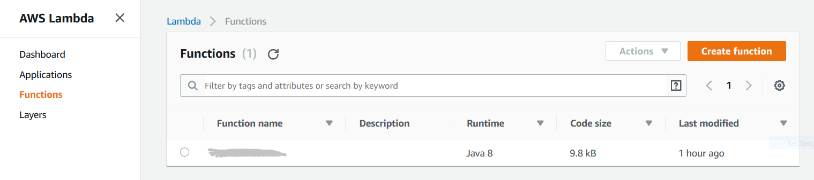

# Desplegar una función en AWS Lambda y configurar un API gateway para accederla

Pasos generales:

1. Generar archivo `.jar` del código fuente.
2. Crear función en AWS Lambda.
3. Configurar API gateway.
4. Probar la función.
5. Desplegar el API.

## 1. Generar archivo `.jar` del código fuente

Abrir el proyecto cuyo código fuente está [en esta ruta](../examples/property-lambda).

Para generar el `.jar`, ir al menú de Maven y ejecutar el comando `package`.

Una vez finalice la generación, el archivo `.jar` quedará en la ruta `target\property-lambda-0.1.0.jar` del proyecto.

## 2. Crear función en AWS Lambda

Ir a https://console.aws.amazon.com/lambda. Se necesitará una cuenta gratuita de Amazon Web Services para este y los siguientes pasos.

Dar clic en *Create Function*.

Configurar la función de acuerdo a la siguiente imagen.

Clic en *Create function*.

En la siguiente pantalla, es necesario subir el `.jar` generado en el paso anterior e indicar la clase y el método que tiene que invocar AWS: `course.microservices.property.lambda.PropertyLambda::handleRequest`.

Clic en el botón *Save* que se encuentra en la parte superior de la página.

## 3. Configurar API gateway

Ir a https://console.aws.amazon.com/apigateway. 

Dar clic en *Create API*.

Indicar un nombre para el API y dar clic en *Create API*.

En la página siguiente, vamos a crear el método HTTP a través del cual se accederá la función.

Dar clic en *Actions* y luego en *Create method*.

Seleccionar *GET* y y luego dar clic en el botón al lado del dropdown.

En la configuración del método, seleccionar *Lambda Function* e indicar el nombre de la función que se asignó en el paso 2.

En el popup para dar permisos, dar clic en *OK*.

## 4. Probar la función

Se puede probar el acceso a la función desde el API Gateway, directamente desde la aplicación de AWS.

Para probar, hay que seleccionar el método y luego *TEST*.

En la página que se abre, clic en el botón *Test*.

## 5. Desplegar el API

Hasta el momento, el API solo es accesible desde la consola de AWS. Para que se pueda probar externamente, es necesario desplegarlo.

Para lo anterior, seleccionar *Deploy API* desde el menú *Actions*.

Esto abrirá un popup donde se debe seleccionar el ambiente al que se desplegará (ejemplos: desarrollo, pruebas, staging, producción). La primera se debe crear uno nuevo seleccionando *[New Stage]*.

Una vez se indique un nombre (en mi caso usé staging) y se dé clic en *Deploy*, la consola mostrará una página con la URL pública  para acceder la función.

Esta URL se puede acceder desde el navegador directamente (ya que estamos usando GET) o desde un programa como [Postman](https://www.getpostman.com/).

Y eso es todo. Siguiendo estos pasos tienes un microservicio corriendo en AWS Lambda, que se accede a través de un API gateway.