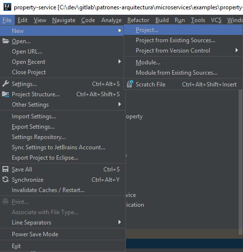
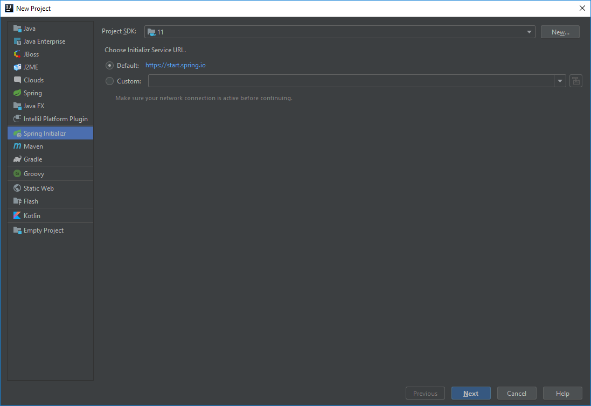
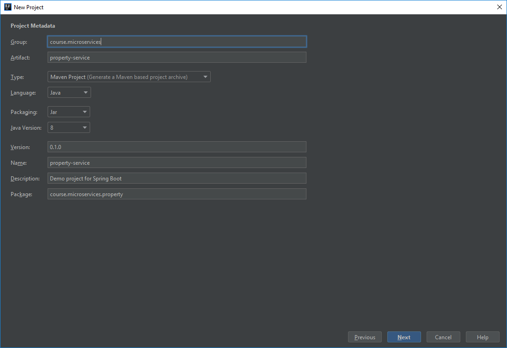
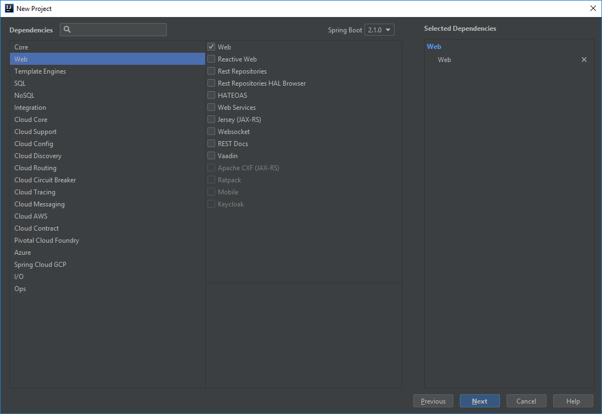
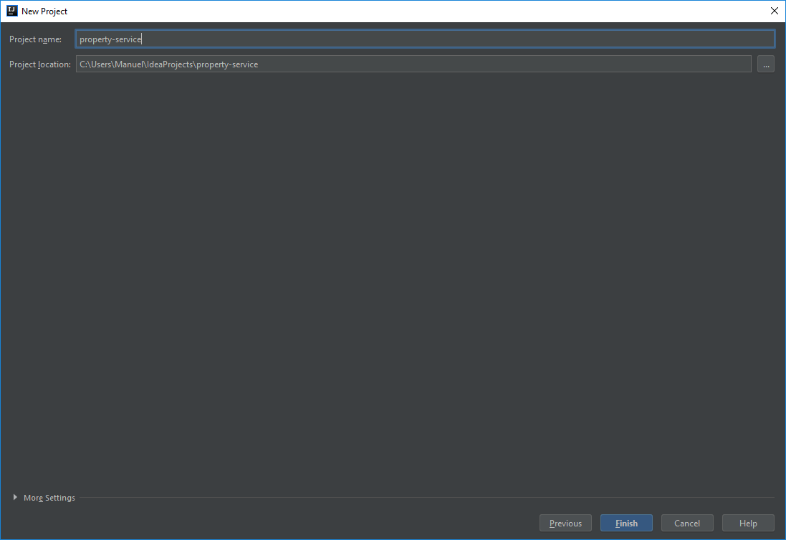

# Cómo generar una aplicación Spring Boot con IntelliJ

Es necesaria la **versión Ultimate de IntelliJ** para seguir este tutorial. Puedes descargar una versión de prueba desde https://www.jetbrains.com/idea/download.

## Crear nuevo proyecto

## Seleccionar Spring Initializr

## Definir las propiedades del proyecto

## Seleccionar la dependencia Web

Esto nos va a permitir configurar servicios REST con Spring Boot.

## Definir el nombre y la ruta del proyecto

Clic en Finalizar.